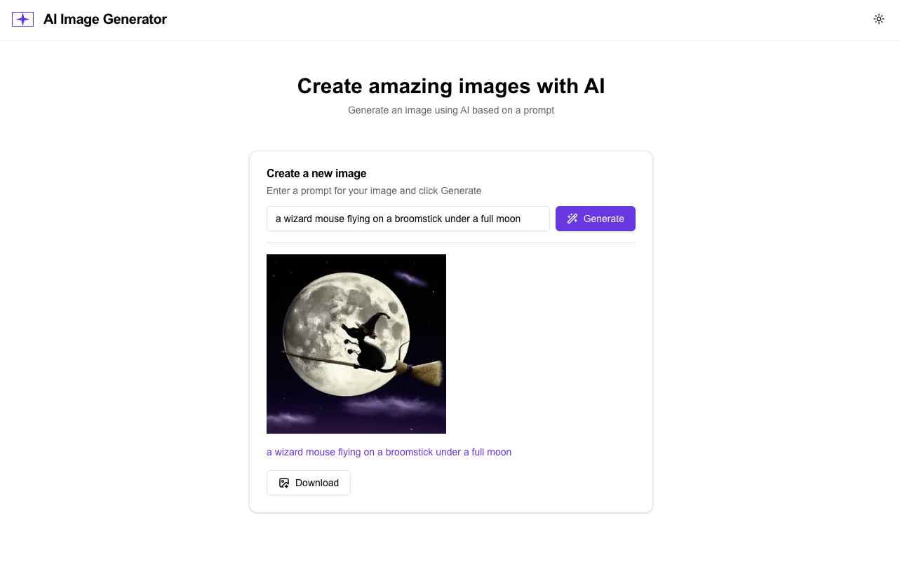
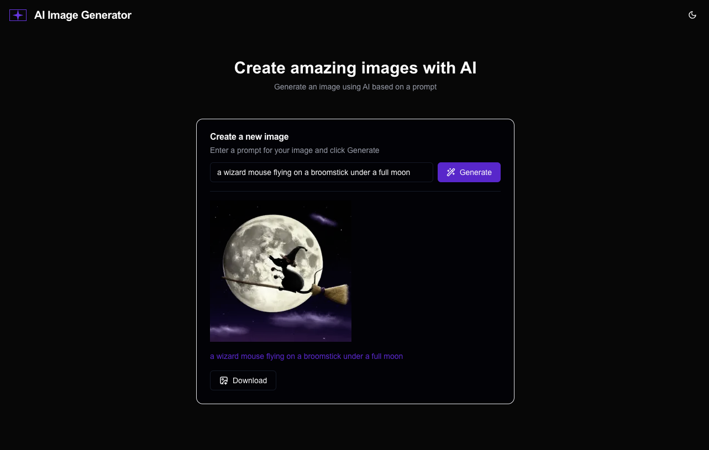

# AI Image Generator

✨ Generate images from text prompts using OpenAI's DALL-E ✨

## Demo

| Light Mode                                    | Dark Mode                                   |
| --------------------------------------------- | ------------------------------------------- |
|  |  |

## Tech Stack

- **Next.js 15**
- **React 19**
- **TypeScript**
- **TailwindCSS**
- **OpenAI API**
- **shadcn**
- **React Hook Form**
- **Zod**
- **FileSaver.js**

## Features

- Generate images from text prompts
- Download generated images
- Responsive design for mobile and desktop
- Dark theme support

## Getting Started

1. Clone the repository:

   ```bash
   git clone https://github.com/your-username/ai-image-generator.git
   cd ai-image-generator
   ```

2. Install dependencies (use `--force` to resolve peer dependency issues):

   ```bash
   npm install --force
   ```

3. Create a `.env` file in the root directory and add your OpenAI API key:

   ```bash
   NEXT_PUBLIC_OPENAI_API_KEY=your-openai-api-key
   ```

4. Start the development server:

   ```bash
   npm run dev
   ```

5. Open [http://localhost:3000](http://localhost:3000) in your browser.
